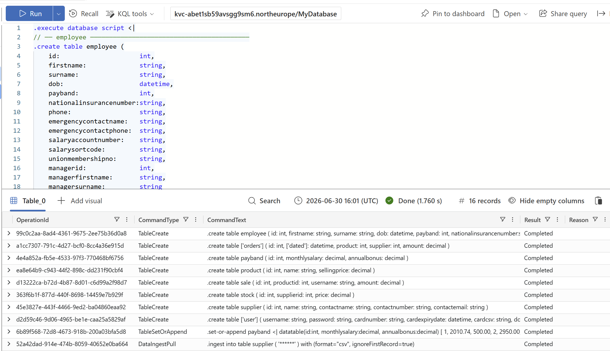

# AA4 Unit 2 Workshop Exercise - Avoiding Prosecution!

For this task you are required to perform a GDPR & Data Quality Audit for a sample database. Let's setup this database first.

## Setup

### Step 1: Login to Azure Data Explorer
Navigate to [Azure Data Explorer (ADX)](https://dataexplorer.azure.com/) and login with either a work or a personal account. Choose the option to create a free cluster (it doesn't matter what you name it - just accept the defaults).

### Step 2: Setup the Database
Once you've signed in and setup your free cluster please select the "Query" icon on the left hand side. From here you should see a query window with a large blue "Run button". In the query window copy the text from [this setup script](./setup.kql) and past it into the window. Next click run and wait for it to complete. 

If you've done everything correctly it should look something like this:

## Identify the problems

Conduct a review of the database and identify as many potential problems as possible.

Things to look out for:

- Personal data that may be covered by GDPR
- Other sensitive data that might be being stored incorrectly
- Any other structural problems

Grade your issues by severity and prioritise them as _high_, _medium_ or _low_ priorities.

When thinking about the priorities (and the solutions below) it's worth keeping in the Data Protection Principles:
- Lawfulness, fairness and transparency
- Purpose limitation
- Data minimisation
- Accuracy
- Storage limitation
- Integrity and confidentiality (security)
- Accountability

## Find the solutions

Once you've identified the problems it's time to decide how to fix them. You can't fix these all with _technical_ changes to the database. You'll also have to think about whether you'll need to change business processes; communicate with your customers; or some combination of these and other things.

Work through your issues in priority order and come up with a plan to fix them.
